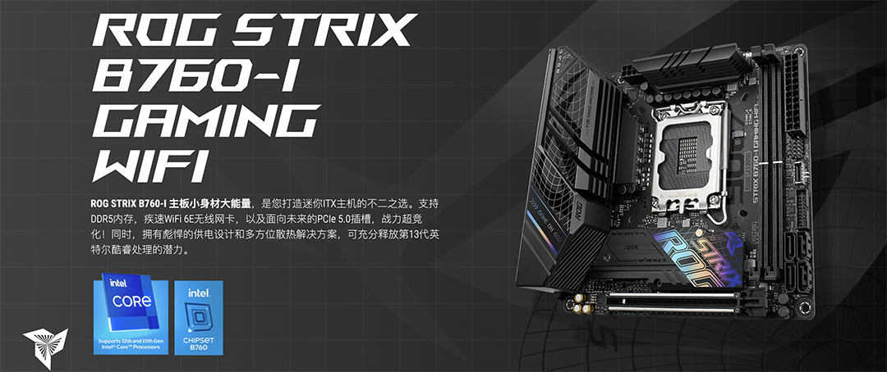

## ROG STRIX B760-I GAMING WiFi Hackintosh OpenCore EFI



### [简体中文](README.zh_CN.md)

### OpenCore

[OpenCore 1.0.4](https://github.com/acidanthera/OpenCorePkg)

### OS Version Tested

- macOS Monterey 12.x
- macOS Ventura    13.x
- macOS Sonoma   14.x 
- macOS Sequoia   15.x 

### Hardware

- Motherboard: ROG STRIX B760-I GAMING WiFi
- Bios Version:1003（2023/04/20）
- CPU: Intel i5-13600k
- RAM: KINGBANK 16GB*2 DDR5 6800MHz
- SSD: 1.WD SN770 512G MacOS
- SSD: 2.WD SN770 512G Windows
- iGPU: Intel UHD Graphic 730 (Only work in Windows)
- GPU: yeston Radeon RX6600
- Audio:ROG SupremeFX 7.1-Channel High Definition Audio CODEC S1220A
- Ethernet Card: Intel® 2.5Gb Ethernet
- Ethernet Card: UGREEN USB LAN （RTL8156）
- WiFi Card: BCM94360CS2
- CPU Cooling: AXP 120 X67 With PHANTEKS T30
- PSU: TT thermaltake Toughpower GF1 650W
- Case: NZXT H1

### Notes

 - Use [OCAuxiliaryTools](https://github.com/ic005k/OCAuxiliaryTools) build your SMBIOS
 - If you want to use a CPU without  Efficient-Core, you must uncheck the option in the config.plist file Kernel--ProvideCurrentCpuinfo

### Bios Setup

```
Advanced

  |-- UEFI Variables Protection
     |-- password protection of Runtime Variables ：Disabled
     
  |-- System Agent(SA)Configuration
     |-- VT-D ：Enabled
     |-- Control Iommu Pre-boot Behavior ：Disable IOMMU
	   
  |--PCI Subsystem Settings
     |-- Above 4G Decoding ：Enabled
     |-- Resize BAR Support ：Disabled
     |-- SR-IOV Support ：Disabled
   
Boot

  |-- Secure Boot
    |-- OS Type ：Other OS
    |-- Secure Boot Mode ：Custom
      
  |-- Boot Configuration
    |-- Fast Boot ：Disabled
      
  |-- CSM (Compatibility Support Module)
    |-- Launch CSM  ：Disabled
```

### Contact UsScreenShot

 - Geekbench5 & Cinebench R20


### Contact Us

 - QQ Group: 23304408

