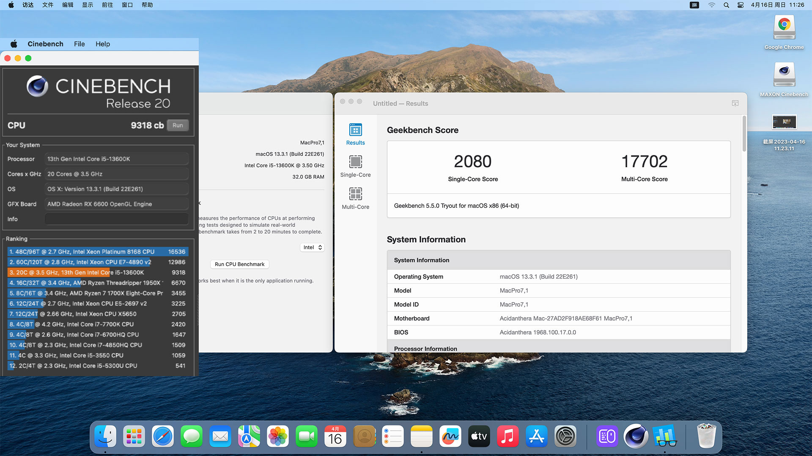

## ROG STRIX B760-I GAMING WiFi Hackintosh OpenCore EFI


### [English](https://github.com/hackintosh-efi/ROG-STRIX-B760-I-GAMING-OpenCore)

### OpenCore

[OpenCore 1.0.2](https://github.com/acidanthera/OpenCorePkg)

### 支持的系统版本

- macOS Monterey 12.x
- macOS Ventura    13.x
- macOS Sonoma   14.x 
- macOS Sequoia   15.x 

### 硬件

- 主板 ROG STRIX B760-I GAMING WiFi
- Bios版本:1003（2023/04/20）
- CPU: Intel i5-13600k
- 内存: KINGBANK 16GB*2 DDR5 6800MHz
- 固态硬盘: 1.WD SN770 512G MacOS
- 固态硬盘: 2.WD SN770 512G Windows
- 核显: Intel UHD Graphic 730 (仅在Windows中使用)
- 独显: 盈通 Radeon RX6600
- 声卡:ROG SupremeFX 7.1-Channel High Definition Audio CODEC S1220A
- 网卡: Intel® 2.5Gb Ethernet
- 网卡: 绿联 USB LAN （RTL8156）
- 无线网卡: BCM94360CS2
- CPU散热器: AXP 120 X67 With PHANTEKS T30
- 电源: TT thermaltake Toughpower GF1 650W
- 机箱: NZXT H1

### 注意事项

 - 安装成功后必须使用 [OCAuxiliaryTools](https://github.com/ic005k/OCAuxiliaryTools) 生成你自己的 SMBIOS
 - 如需使用没有小核心的CPU，必须取消勾选配置文件中Kernel--ProvideCurrentCpuinfo选项

### Bios Setup

```
dvanced

  |-- UEFI Variables Protection
     |-- password protection of Runtime Variables ：Disabled
     
  |-- System Agent(SA)Configuration
     |-- VT-D ：Enabled
     |-- Control Iommu Pre-boot Behavior ：Disable IOMMU
	   
  |--PCI Subsystem Settings
     |-- Above 4G Decoding ：Enabled
     |-- Resize BAR Support ：Disabled
     |-- SR-IOV Support ：Disabled
   
Boot

  |-- Secure Boot
    |-- OS Type ：Other OS
    |-- Secure Boot Mode ：Custom
      
  |-- Boot Configuration
    |-- Fast Boot ：Disabled
      
  |-- CSM (Compatibility Support Module)
    |-- Launch CSM  ：Disabled
```


### 系统截图

 - Geekbench5 & Cinebench R20




### 联系我们

 - QQ群: 23304408

